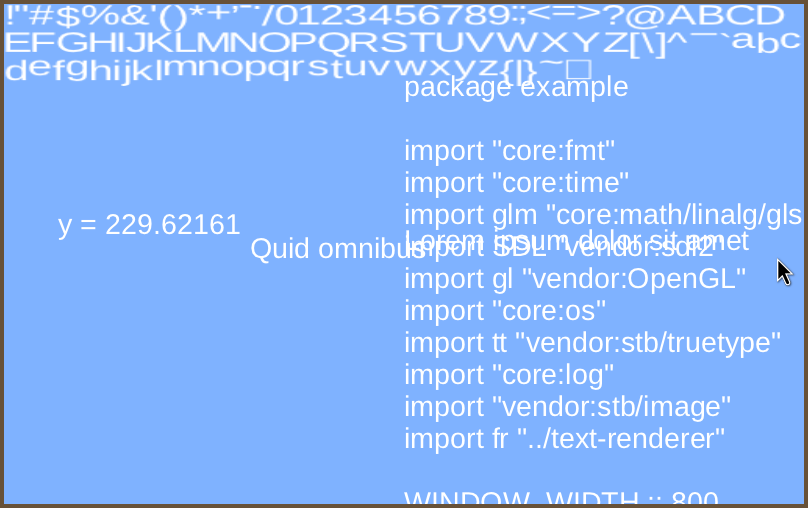

### Description
A small package for drawing immediate mode truetype fonts in OpenGL 3.3. Uses `stb-truetype`.

### Usage
In this example `LiberationSans-Regular.tff` is in the directory the program is run from.

``` odin
    import fr "text-renderer"
    ... 
    // Set up OpenGL
    ...
	info := fr.FontInfo{"LiberationSans-Regular.ttf", 32, 32, 96}
	font_renderer: fr.FontRenderer 
	font_error := fr.font_renderer_init(&font_renderer, info)
	defer fr.font_renderer_delete(&font_renderer)
    ...
    main_loop: for {

		fr.font_renderer_draw_text(&font_renderer, "Lorem ipsum dolor sit amet", 400, 200)
		fr.font_renderer_render(&font_renderer, WINDOW_WIDTH, WINDOW_HEIGHT)

    }
```

For debug purposes, to view the current baked chacters on loaded onto the graphics card you can use `fr.font_renderer_draw_baked_bitmap(&font_renderer, width, height)` which will render all the glyphs available to the renderer.

